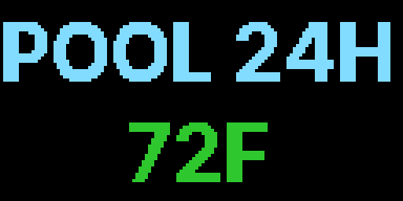

# led-ticker-pool

A pool water-temperature monitor **widget** for [led-ticker](https://github.com/JamesAwesome/led-ticker), backed by an InfluxDB v2 server (e.g. [pool_monitor](https://github.com/JamesAwesome/pool_monitor)). It's a led-ticker **plugin** — installing this package contributes a `pool.monitor` widget you reference in your led-ticker config.

It cycles four screens — a title card, today's current temperature with a trend arrow (▲/▼/–) and hi/lo, a 7-day mean with hi/lo, and a season (current-year) hi/lo. Temperature is zone-colored — blue below 70°F, green 70–79°F, orange 80–89°F, red 90°F+ — so the comfort level is readable at a glance. Data is fetched in the background via async polling, so the display keeps running even if the server is briefly unreachable.

## Screenshots

**`layout = "ticker"`** (default — single-row segmented screens, smallsign-friendly):


**`layout = "two_row"`** (stacked label-on-top / big-number-on-bottom, bigsign / longboi):



## Install

The widget auto-registers via the `led_ticker.plugins` entry point — once the package is installed, no `[plugins]` config change is needed.

**Into a containerized led-ticker (recommended):** add this package to `config/requirements-plugins.txt` (copy it from `config/requirements-plugins.example.txt`, which already lists it), then rebuild:

```bash
# in your led-ticker checkout
cp config/requirements-plugins.example.txt config/requirements-plugins.txt
docker compose up -d --build
```

**Standalone (bare-metal / a venv that already has led-ticker):**

```bash
pip install "git+https://github.com/JamesAwesome/led-ticker-pool.git@main"
```

(led-ticker isn't on PyPI; in the image it's already installed, so the plugin resolves without it. See the led-ticker [Plugins docs](https://docs.ledticker.dev/plugins/) for the constraint-based install.)

## Configuration

Reference the widget in a playlist section by `type = "pool.monitor"`:

```toml
[[playlist.section.widget]]
type = "pool.monitor"
title = "POOL TEMPS"
units = "imperial"
```

### Options

| Option | Type | Default | Description |
|--------|------|---------|-------------|
| `title` | string | `"POOL TEMPS"` | Label shown on the title screen. |
| `sensor_id` | string | none | Sensor ID to filter on. Omit to use the only/first sensor in the bucket. Must match `[A-Za-z0-9_-]+`. |
| `units` | string | `"imperial"` | `"imperial"` (°F) or `"metric"` (°C). |
| `update_interval` | int | `300` | Seconds between InfluxDB fetches (5 min default). |
| `current_window` | string | `"-24h"` | How far back to search for the latest reading, as a negative Flux duration (`"-24h"`, `"-90m"`). Older than this → `--` placeholder. Widen it if your sensor reports infrequently. |
| `stale_after` | float | `14400` | Seconds since the last reading before the temperature dims to gray (stale signal). 4 h default. |
| `influxdb_url` | string | `$INFLUXDB_URL` / `"http://influxdb:8086"` | InfluxDB v2 base URL. Config overrides the env var. |
| `influxdb_org` | string | `$INFLUXDB_ORG` / `"pool"` | InfluxDB organization. |
| `influxdb_bucket` | string | `$INFLUXDB_BUCKET` / `"pool_temps"` | InfluxDB bucket. |
| `influxdb_token` | string | `$INFLUXDB_TOKEN` | InfluxDB v2 token. **Required** — the widget raises `ValueError` at startup if it's missing. |
| `layout` | `"ticker"` \| `"two_row"` | `"ticker"` | Render mode (see below). |
| `label_color` | `[r,g,b]` | white | Color for prefix labels / separators. |
| `top_font` / `top_font_size` / `top_font_threshold` | font / int / int | inherit | **two_row only:** top (label) row font knobs. |
| `bottom_font` / `bottom_font_size` / `bottom_font_threshold` | font / int / int | inherit | **two_row only:** bottom (value) row font knobs. |
| `top_row_height` | int (logical rows) | `None` | **two_row only:** top band height. `None` = symmetric 8/8 split. |

The per-row knobs apply ONLY when `layout = "two_row"`; setting them under `ticker` fails config validation.

### Layouts

- **`ticker`** (default) — single-row segmented screens; the today screen shows current temp + trend arrow and hi/lo, the 7-day screen the mean + hi/lo, the season screen HI/LO together. Best for small panels (smallsign 160×16).
- **`two_row`** — stacked label-on-top / big-number-on-bottom. Cycles four screens with top-row labels `POOL` (title), `POOL 24H` (current temp, zone-colored), `POOL 7D` (7-day HI/LO), and `POOL SEASON` (season HI/LO) — HI in orange, LO in blue, shown together on one screen (e.g. `84/72°F`). The trend arrow is dropped (bottom is the value only). Best for bigsign / longboi (256×64 / 512×64).

A `two_row` example:

```toml
[[playlist.section.widget]]
type = "pool.monitor"
title = "POOL TEMPS"
layout = "two_row"
units = "imperial"
font = "Inter-Regular"
font_size = 32
label_color = [130, 220, 255]
```

## InfluxDB setup

The widget reads connection details from your led-ticker `.env` (or per-widget overrides). `INFLUXDB_TOKEN` is required; the rest default to the standard pool_monitor Docker Compose stack.

| Variable | Required | Default | Description |
|----------|----------|---------|-------------|
| `INFLUXDB_TOKEN` | **yes** | — | InfluxDB v2 auth token. |
| `INFLUXDB_URL` | no | `http://influxdb:8086` | Base URL. |
| `INFLUXDB_ORG` | no | `pool` | Organization. |
| `INFLUXDB_BUCKET` | no | `pool_temps` | Bucket. |

The widget queries water-temperature readings with Flux over HTTP and computes today / 7-day / season aggregates. Stale data (older than `stale_after`) renders dim gray; the trend arrow compares the latest reading to a 30-minute trailing average (sub-0.5°F shows `–`).

## Development

led-ticker isn't on PyPI, so install it editable from a sibling checkout. This repo's `pyproject.toml` pins `led-ticker` to `../led-ticker` via `[tool.uv.sources]`:

```bash
git clone https://github.com/JamesAwesome/led-ticker ../led-ticker   # sibling checkout
git clone https://github.com/JamesAwesome/led-ticker-pool && cd led-ticker-pool
uv venv
uv pip install -e ../led-ticker -e ".[dev]"
uv run pytest -q
```

> **Note:** led-ticker's `graphics` surface works headless via its bundled stub, but the full `RGBMatrix`/canvas test stub lives in led-ticker's `tests/stubs/` and isn't shipped. This repo's tests put it on the path via `pyproject.toml`'s `[tool.pytest.ini_options] pythonpath = ["../led-ticker/tests/stubs"]`.

## Links

- led-ticker project: <https://github.com/JamesAwesome/led-ticker>
- led-ticker plugin system: <https://docs.ledticker.dev/plugins/>
